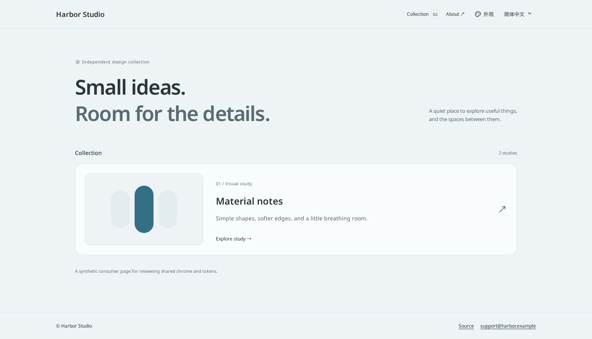
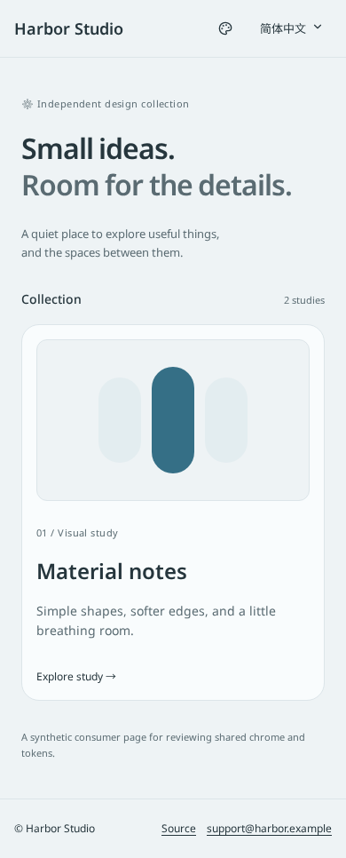

# UI source review evidence

These are native Chromium captures of an isolated synthetic consumer, not a production deployment.
The owner approved the compact chrome/source direction; merge and final consumer acceptance remain
with the owner. The before image uses the published frontend 0.2.0. Current captures use the same
fixture and the owner-authorized **local Noto font preview** in Cloud. Production registry CSS uses
the Google Fonts API directly; these images do not verify browser API/network/CSP delivery.

The local preview downloads the intended official Google Noto font files with normal TLS and serves
them from ignored test artifacts. Font binaries, preview adapters and download scripts are absent
from the source registry. Cloud Chromium reports `ERR_CERT_AUTHORITY_INVALID` for the real API,
while normal CLI TLS returns HTTP 200. No certificate store or TLS security setting was changed.

| State | Evidence |
| --- | --- |
| Published 0.2.0 / Ocean light | [Before](before-0.2.0.png) |
| Noto preview / Ocean light, Chinese controls, 1500×860 | [Desktop](noto-local-preview-desktop.png) |
| Noto preview / Ocean light, Chinese controls, 390×844 | [Mobile](noto-local-preview-mobile.png) |
| Noto preview / appearance popup | [Menu](noto-local-preview-menu.png) |
| Noto preview / Neutral dark | [Dark](noto-local-preview-dark.png) |
| Noto preview / appearance and locale entry/exit | [Motion clip](noto-local-preview-motion.mp4) |

Current Chinese controls are 66×44 and 90×44 with 13px text; the mobile appearance control is 44×44.
Borders are transparent at rest, with a 32px hover/open surface inside the 44px hit target. Measurements
and detected CSS animations are recorded in [the capture receipt](noto-local-preview-measurements.json).

English/CJK font usage, loaded weight 600, distinct Latin weight metrics and no synthesis are tested
through actual Chromium rendering. The current monochrome emoji candidate still fails the VS16
heart test because Chromium selects a platform color font. The owner emoji-family choice remains
pending; the test is retained as an acceptance gate. Default GitHub CI uses the actual Google API.
After owner merge, fresh public source installation with the full approved SHA must pass before
consumer migration acceptance. These captures do not replace either gate.

